# MCP Gateway

**MCP Gateway** is a reverse proxy and management layer for [Model Context Protocol (MCP)](https://modelcontextprotocol.io/introduction) servers, enabling scalable, session-aware routing, authorization and lifecycle management of MCP servers in Kubernetes environments.

## Table of Contents

- [Overview](#overview)
- [Key Concepts](#key-concepts)
- [Architecture](#architecture)
- [Features](#features)
- [Getting Started – Local Deployment](#getting-started---local-deployment)
- [Getting Started – 1-Click Deploy to Azure](#getting-started---deploy-to-azure)

## Overview

This project provides:

- A data gateway for routing traffic to MCP servers with session affinity.
- A control plane for managing the MCP server lifecycle (deploy, update, delete).
- Enterprise-ready integration points including telemetry, access control and observability.

## Key Concepts

- **MCP Server**: A server implementing the Model Context Protocol, which typically a streamable HTTP endpoint.
- **Adapters**: Logical resources representing MCP servers in the gateway, managed under the `/adapters` scope. Designed to coexist with other resource types (e.g., `/agents`) in a unified AI development platform.
- **Tools**: Registered resources with MCP tool definitions that can be dynamically routed via the tool gateway router. Each tool includes metadata about its execution endpoint and input schema.
- **Tool Gateway Router**: An MCP server that acts as an intelligent router, directing tool execution requests to the appropriate registered tool servers based on tool definitions. Multiple router instances may run behind the gateway for session affinity.
- **Session-Aware Stateful Routing**: Ensures that all requests with a given `session_id` are consistently routed to the same MCP server instance.

## Architecture

```mermaid
flowchart LR
    subgraph Clients[" "]
        direction TB
        DataClient["🔌 Agent/MCP<br>Data Client"]
        MgmtClient["⚙️ Management<br>Client"]
    end

    subgraph Gateway["MCP Gateway"]
        direction TB
        
        subgraph Auth1["Authentication & Authorization"]
            Auth["🔐 Data Plane Auth<br>Bearer Token / RBAC"]
            Auth2["🔐 Control Plane Auth<br>Bearer Token / RBAC"]
        end
        
        subgraph DataPlane["Data Plane"]
            Routing["🔀 Adapter Routing<br>/adapters/{name}/mcp"]
            ToolRouting["🔀 Tool Router Gateway<br>/mcp"]
        end

        subgraph ControlPlane["Control Plane"]
            direction LR
            AdapterMgmt["📦 Adapter Management<br>/adapters CRUD"]
            ToolMgmt["🔧 Tool Management<br>/tools CRUD"]
        end
        
        subgraph Management["Backend Services"]
            DeploymentMgmt["☸️ Deployment Manager"]
            MetadataMgmt["📋 Metadata Manager"]
        end
    end

    subgraph Cluster["Kubernetes Cluster"]
        direction TB
        
        subgraph ServerRow[" "]
            direction LR
            
            subgraph MCPServers["MCP Servers"]
                direction TB
                PodA["mcp-a-0"]
                PodA1["mcp-a-1"]
                PodB["mcp-b-0"]
            end
            
            subgraph ToolRouters["Tool Gateway Routers"]
                direction TB
                Router1["toolgateway-0"]
                Router2["toolgateway-1"]
            end
        end
        
        subgraph ToolServers["Registered Tool Servers"]
            direction LR
            Tool1["tool-1-0"]
            Tool2["tool-2-0"]
        end
    end

    Metadata[("💾 Metadata Store<br>Server & Tool Info")]

    DataClient -->|"MCP Requests"| Auth
    MgmtClient -->|"API Calls"| Auth2
    
    Auth --> Routing
    Auth --> ToolRouting
    Auth2 --> AdapterMgmt
    Auth2 --> ToolMgmt
    
    AdapterMgmt & ToolMgmt --> DeploymentMgmt
    AdapterMgmt & ToolMgmt --> MetadataMgmt
    
    Routing -.->|"Session Affinity"| MCPServers
    ToolRouting -.->|"Session Affinity"| ToolRouters
    ToolRouters ==>|"Dynamic Routing"| ToolServers
    
    DeploymentMgmt -->|"Deploy & Monitor"| Cluster
    MetadataMgmt <-->|"Read/Write"| Metadata

    style Gateway fill:#e1f5ff
    style Cluster fill:#fff4e1
    style Metadata fill:#f0f0f0
```



## Features

### Control Plane – RESTful APIs for MCP Server Management

#### MCP Server Management (Adapters)

- `POST /adapters` — Deploy and register a new MCP server.
- `GET /adapters` — List all MCP servers the user can access.
- `GET /adapters/{name}` — Retrieve metadata for a specific adapter.
- `GET /adapters/{name}/status` — Check the deployment status.
- `GET /adapters/{name}/logs` — Access the server's running logs.
- `PUT /adapters/{name}` — Update the deployment.
- `DELETE /adapters/{name}` — Remove the server.

#### Tool Registration and Management

- `POST /tools` — Register and deploy a tool with MCP tool definition metadata.
- `GET /tools` — List all registered tools the user can access.
- `GET /tools/{name}` — Retrieve metadata and tool definition for a specific tool.
- `GET /tools/{name}/status` — Check the tool deployment status.
- `GET /tools/{name}/logs` — Access the tool server's running logs.
- `PUT /tools/{name}` — Update a tool deployment and definition.
- `DELETE /tools/{name}` — Remove a registered tool.

### Data Plane – Gateway Routing for MCP Servers

#### Direct MCP Server Access

- `POST /adapters/{name}/mcp` — Establish a streamable HTTP connection.

#### Dynamic Tool Routing via Tool Gateway Router

- `POST /mcp` — Route requests to the tool gateway router, which dynamically routes to registered tools based on tool definitions. The router itself is an MCP server with multiple instances hosted behind the gateway for scalability.

### Authentication & Authorization Support

The gateway provides entra id authentication and basic application role authorization for mcp servers and tools:

- **Read** access is granted to the resource creator, principals assigned the configured role values (for example `mcp.engineer`), and anyone holding the mandatory administrator role `mcp.admin`.
- **Write** access is restricted to the resource creator or principals holding the `mcp.admin` role.

For step-by-step guidance on configuring Azure Entra ID (creating `mcp.admin` and other role values, assigning them to users or service principals, and supplying those values in adapter/tool payloads), see [docs/entra-app-roles.md](docs/entra-app-roles.md).

### Additional Capabilities

- *New*: Support for **Proxying Local & Remote MCP Servers**. See [examples and usage](sample-servers/mcp-proxy/README.md).
- Stateless reverse proxy with a distributed session store (production mode).
- Kubernetes-native deployment using StatefulSets and headless services.

### Tool Registration and Dynamic Routing

The MCP Gateway now supports **tool registration** with dynamic routing capabilities, enabling a scalable architecture for managing and executing MCP tools.

### How It Works

1. **Tool Registration**: Developers register tools via the `/tools` API endpoint, providing:
   - Container image details (name and version)
   - MCP tool definition (name, description, input schema)
   - Execution endpoint configuration (port and path)
   - Deployment configuration (replicas, environment variables)

2. **Tool Gateway Router**: A specialized MCP server that acts as an intelligent router:
   - Runs as multiple instances behind the gateway for high availability
   - Maintains awareness of all registered tools and their definitions
   - Dynamically routes tool execution requests to the appropriate tool server
   - Accessed via `POST /mcp` endpoint (without adapter name)

3. **Dynamic Routing**: When clients send MCP requests to `/mcp`:
   - The gateway routes requests to available tool gateway router instances with session affinity
   - The router analyzes the tool call in the request
   - Based on the tool definition, it forwards the execution to the correct registered tool server
   - Results are returned through the router back to the client

## Getting Started - Local Deployment

### 1. Prepare Local Development Environment
- [Install .NET 8 SDK](https://dotnet.microsoft.com/en-us/download/dotnet/8.0)
- [Install Docker Desktop](https://docs.docker.com/desktop/)
- [Install and turn on Kubernetes](https://docs.docker.com/desktop/features/kubernetes/#install-and-turn-on-kubernetes)

### 2. Run Local Docker Registry
   ```sh
   docker run -d -p 5000:5000 --name registry registry:2.7
   ```

### 3. Build & Publish MCP Server Images
Build and push the MCP server images to your local registry (`localhost:5000`).
```sh
docker build -f sample-servers/mcp-example/Dockerfile sample-servers/mcp-example -t localhost:5000/mcp-example:1.0.0
docker push localhost:5000/mcp-example:1.0.0
```

### 4. Build & Publish MCP Gateway and Tool Gateway Router
(Optional) Open `dotnet/Microsoft.McpGateway.sln` with Visual Studio.

Publish the MCP Gateway image:
```sh
dotnet publish dotnet/Microsoft.McpGateway.Service/src/Microsoft.McpGateway.Service.csproj -c Release /p:PublishProfile=localhost_5000.pubxml
```

Publish the Tool Gateway Router image:
```sh
dotnet publish dotnet/Microsoft.McpGateway.Tools/src/Microsoft.McpGateway.Tools.csproj -c Release /p:PublishProfile=localhost_5000.pubxml
```

### 5. Deploy MCP Gateway to Kubernetes Cluster
Apply the deployment manifests:
```sh
kubectl apply -f deployment/k8s/local-deployment.yml
```

### 6. Enable Port Forwarding
Forward the gateway service port:
```sh
kubectl port-forward -n adapter svc/mcpgateway-service 8000:8000
```

### 7. Test the API - MCP Server Management
- Import the OpenAPI definition from `openapi/mcp-gateway.openapi.json` into tools like [Postman](https://www.postman.com/), [Bruno](https://www.usebruno.com/), or [Swagger Editor](https://editor.swagger.io/).

- Send a request to create a new adapter resource:
  ```http
  POST http://localhost:8000/adapters
  Content-Type: application/json
  ```
   ```json
   {
      "name": "mcp-example",
      "imageName": "mcp-example",
      "imageVersion": "1.0.0",
      "description": "test"
   }
   ```

### 8. Test the API - MCP Server Access 
- After deploying the MCP server, use a client like [VS Code](https://code.visualstudio.com/) to test the connection. Refer to the guide: [Use MCP servers in VS Code](https://code.visualstudio.com/docs/copilot/chat/mcp-servers). 
  > **Note:** Ensure VSCode is up to date to access the latest MCP features.

  - To connect to the deployed `mcp-example` server, use:  
     - `http://localhost:8000/adapters/mcp-example/mcp` (Streamable HTTP)

  Sample `.vscode/mcp.json` that connects to the `mcp-example` server
  ```json
  {
    "servers": {
      "mcp-example": {
        "url": "http://localhost:8000/adapters/mcp-example/mcp",
      }
    }
  }
  ```

- For other servers:  
  - `http://localhost:8000/adapters/{name}/mcp` (Streamable HTTP)  

### 9. Test Tool Registration and Dynamic Routing

#### Build & Publish a Tool Server Image

First, build and push a tool server image to your local registry:
```sh
docker build -f sample-servers/tool-example/Dockerfile sample-servers/tool-example -t localhost:5000/weather-tool:1.0.0
docker push localhost:5000/weather-tool:1.0.0
```

#### Register a Tool

Send a request to register a tool with its definition:
```http
POST http://localhost:8000/tools
Content-Type: application/json
```
```json
{
  "name": "weather",
  "imageName": "weather-tool",
  "imageVersion": "1.0.0",
  "description": "Weather tool for getting current weather information",
  "toolDefinition": {
    "tool": {
      "name": "weather",
      "title": "Weather Information",
      "description": "Gets the current weather for a specified location.",
      "type": "http",
      "inputSchema": {
        "type": "object",
        "properties": {
          "location": {
            "type": "string",
            "description": "The city and state, e.g. San Francisco, CA"
          }
        },
        "required": ["location"]
      }
    },
    "port": 8000
  }
}
```

#### Verify Tool Deployment

Check the tool deployment status:
```http
GET http://localhost:8000/tools/weather/status
```

#### Test Tool Routing via Tool Gateway Router

Use an MCP client (like VS Code) to connect to the tool gateway router:

Sample `.vscode/mcp.json` that connects to the tool gateway router:
```json
{
  "servers": {
    "tool-gateway": {
      "url": "http://localhost:8000/mcp"
    }
  }
}
```

The router will automatically route tool calls to the appropriate registered tool servers based on the tool name in the MCP request.

### 10. Clean the Environment  
   To remove all deployed resources, delete the Kubernetes namespace:
   ```sh
   kubectl delete namespace adapter
   ```

## Getting Started - Deploy to Azure

### Cloud Infrastructure


### 1. Prepare Cloud Development Environment
- An active [Azure subscription](https://azure.microsoft.com) with **Owner** access
- [Install Azure CLI](https://learn.microsoft.com/en-us/cli/azure/install-azure-cli)

### 2. Setup Entra ID (Azure Active Directory)

The cloud-deployed service requires bearer token authentication using Azure Entra ID. Follow these steps to configure an app registration.

#### Create and Configure the App Registration

1. Go to [App Registrations](https://portal.azure.com/#view/Microsoft_AAD_RegisteredApps/ApplicationsListBlade)
2. Click **+ New registration**
   - **Name**: Choose a meaningful name, e.g., `mcp-gateway`
   - **Supported account types**: Select **Single tenant**
   - Click **Register**

3. Go to the app registration **Overview** and copy:
   - **Application (client) ID** — this is your API Client ID for deployment

#### Expose an API (Define a Scope)

1. In the left menu, go to **Expose an API**
2. Click **Add** next to **Application ID URI**, and leave it as the default value:
   ```
   api://<your-client-id>
   ```

3. Click **+ Add a scope**
   - **Scope name**: `access`
   - **Admin consent display name**: `Access MCP Gateway`
   - **Admin consent Description**: Any brief description
   - Click **Add scope**

#### Authorize Azure CLI & VS Code as a Client Application

To allow Azure CLI & VS Code to work as the client for token acquisition.

1. Still in **Expose an API**, scroll down to **Authorized client applications**
2. Click **+ Add a client application**
   - **Client ID**: `04b07795-8ddb-461a-bbee-02f9e1bf7b46` (Azure CLI)
   - **Client ID**: `aebc6443-996d-45c2-90f0-388ff96faa56` (VS Code)
   - In Authorized scopes, select the scope `access`
   - Click **Add**

#### Configure Application Role for Authorization
[docs/entra-app-roles.md](docs/entra-app-roles.md)

### 3. Deploy Service Resources

[](https://portal.azure.com/#create/Microsoft.Template/uri/https%3A%2F%2Fraw.githubusercontent.com%2Fmicrosoft%2Fmcp-gateway%2Fmain%2Fdeployment%2Finfra%2Fazure-deployment.json)

**Parameters**
| Name              | Description                                                                                                      |
|-------------------|------------------------------------------------------------------------------------------------------------------|
| `resourceGroup`   | The name of the resource group. Must contain only lowercase letters and numbers (alphanumeric).                 |
| `clientId`        | The Entra ID (Azure AD) client ID from your app registration.                                                    |
| `location`        | *(Optional)* The Azure region where resources will be deployed.<br/>Defaults to the resource group's location.   |
| `resourceLabel`   | *(Optional)* A lowercase alphanumeric string used as a suffix for naming resources and as the DNS label.<br/>If not provided, it will be the resourceGroup name.<br/>**Recommendation:** Set this value as the default the same with resource group name and make sure resource group name contains only lower alphanumeric. |


The deployment will:
- Deploy Azure infrastructure via Bicep templates

   | Resource Name                 | Resource Type               |
   |-------------------------------|-----------------------------|
   | mgreg\<resourceLabel>         | Container Registry          |
   | mg-storage-\<resourceLabel>   | Azure Cosmos DB Account     |
   | mg-aag-\<resourceLabel>       | Application Gateway         |
   | mg-ai-\<resourceLabel>        | Application Insights        |
   | mg-aks-\<resourceLabel>       | Kubernetes Service (AKS)    |
   | mg-identity-\<resourceLabel>  | Managed Identity            |
   | mg-pip-\<resourceLabel>       | Public IP Address           |
   | mg-vnet-\<resourceLabel>      | Virtual Network             |

- Deploy Kubernetes resources (including `mcp-gateway`) to the provisioned AKS cluster

> **Note:** It's recommended to use Managed Identity for credential-less authentication. This deployment follows that design.

### 4. Build & Publish MCP Server Images
The gateway service pulls the MCP server image from the newly provisioned Azure Container Registry (ACR) during deployment.

Build the MCP server image in ACR:

```sh
az acr build -r "mgreg$resourceLabel" -f sample-servers/mcp-example/Dockerfile sample-servers/mcp-example -t "mgreg$resourceLabel.azurecr.io/mcp-example:1.0.0"
```

### 5. Test the API - MCP Server Management

- Import the OpenAPI spec from `openapi/mcp-gateway.openapi.json` into [Postman](https://www.postman.com/), [Bruno](https://www.usebruno.com/), or [Swagger Editor](https://editor.swagger.io/)

- Acquire a bearer token locally:
  ```sh
  az account get-access-token --resource $clientId
  ```

- Send a POST request to create an adapter resource:
  ```http
  POST http://<resourceLabel>.<location>.cloudapp.azure.com/adapters
  Authorization: Bearer <token>
  Content-Type: application/json
  ```
  ```json
  {
    "name": "mcp-example",
    "imageName": "mcp-example",
    "imageVersion": "1.0.0",
    "description": "test",
    "requiredRoles": [] // Add entra id application role to restrict access
  }
  ```

### 6. Test the API - MCP Server Access

- After deploying the MCP server, use a client like [VS Code](https://code.visualstudio.com/) to test the connection. Refer to the guide: [Use MCP servers in VS Code](https://code.visualstudio.com/docs/copilot/chat/mcp-servers). 
  > **Note:** Ensure VSCode is up to date to access the latest MCP features.

  - To connect to the deployed `mcp-example` server, use:  
     - `http://<resourceLabel>.<location>.cloudapp.azure.com/adapters/mcp-example/mcp` (Streamable HTTP)

  Sample `.vscode/mcp.json` that connects to the `mcp-example` server
  ```json
  {
    "servers": {
      "mcp-example": {
        "url": "http://<resourceLabel>.<location>.cloudapp.azure.com/adapters/mcp-example/mcp",
      }
    }
  }
  ```
  > **Note:** Authentication is still required to access the MCP server, VS Code will help handle the authentication process.

- For other servers:  
  - `http://<resourceLabel>.<location>.cloudapp.azure.com/adapters/{name}/mcp` (Streamable HTTP)  

### 7. Test Tool Registration and Dynamic Routing

#### Build & Publish a Tool Server Image

Build and push a tool server image to ACR:
```sh
az acr build -r "mgreg$resourceLabel" -f sample-servers/tool-example/Dockerfile sample-servers/tool-example -t "mgreg$resourceLabel.azurecr.io/weather-tool:1.0.0"
```

#### Register a Tool

Acquire a bearer token:
```sh
az account get-access-token --resource $clientId
```

Send a request to register a tool with its definition:
```http
POST http://<resourceLabel>.<location>.cloudapp.azure.com/tools
Authorization: Bearer <token>
Content-Type: application/json
```
```json
{
  "name": "weather",
  "imageName": "weather-tool",
  "imageVersion": "1.0.0",
  "useWorkloadIdentity": true,
  "description": "Weather tool for getting current weather information",
  "requiredRoles": [], // Add entra id application role to restrict access
  "toolDefinition": {
    "tool": {
      "name": "weather",
      "title": "Weather Information",
      "description": "Gets the current weather for a specified location.",
      "type": "http",
      "inputSchema": {
        "type": "object",
        "properties": {
          "location": {
            "type": "string",
            "description": "The city and state, e.g. San Francisco, CA"
          }
        },
        "required": ["location"]
      },
      "annotations": {
        "readOnly": true
      }
    },
    "port": 8000
  }
}
```

#### Verify Tool Deployment

Check the tool deployment status:
```http
GET http://<resourceLabel>.<location>.cloudapp.azure.com/tools/weather/status
Authorization: Bearer <token>
```

#### Test Tool Routing via Tool Gateway Router

Use an MCP client (like VS Code) to connect to the tool gateway router:

Sample `.vscode/mcp.json` that connects to the tool gateway router:
```json
{
  "servers": {
    "tool-gateway": {
      "url": "http://<resourceLabel>.<location>.cloudapp.azure.com/mcp"
    }
  }
}
```
> **Note:** Authentication is required. VS Code will handle the authentication process.

The router will automatically route tool calls to the appropriate registered tool servers based on the tool name in the MCP request.

### 8. Clean the Environment
To remove all deployed resources, delete the resource group from Azure portal or run:
```sh
az group delete --name <resourceGroupName> --yes
```

### 9. Production Onboarding

- **TLS Configuration**  
  Set up HTTPS on Azure Application Gateway (AAG) listener using valid TLS certificates.

- **Network Security**  
  Restrict incoming traffic within the virtual network and configure Private Endpoints for enhanced network security.

- **Telemetry**  
  Enable advanced telemetry, detailed metrics, and alerts to support monitoring and troubleshooting in production.

- **Scaling**  
  Adjust scaling for `mcp-gateway` services and MCP servers based on expected load.

- **Authentication & Authorization**  
  Set up OAuth 2.0 with Azure Entra ID (AAD) for authentication.
  Implement fine-grained access control using RBAC or custom ACLs for `adapter` level permissions.

## Contributing

This project welcomes contributions and suggestions.  Most contributions require you to agree to a
Contributor License Agreement (CLA) declaring that you have the right to, and actually do, grant us
the rights to use your contribution. For details, visit https://cla.opensource.microsoft.com.

When you submit a pull request, a CLA bot will automatically determine whether you need to provide
a CLA and decorate the PR appropriately (e.g., status check, comment). Simply follow the instructions
provided by the bot. You will only need to do this once across all repos using our CLA.

This project has adopted the [Microsoft Open Source Code of Conduct](https://opensource.microsoft.com/codeofconduct/).
For more information see the [Code of Conduct FAQ](https://opensource.microsoft.com/codeofconduct/faq/) or
contact [opencode@microsoft.com](mailto:opencode@microsoft.com) with any additional questions or comments.

## Trademarks

This project may contain trademarks or logos for projects, products, or services. Authorized use of Microsoft 
trademarks or logos is subject to and must follow 
[Microsoft's Trademark & Brand Guidelines](https://www.microsoft.com/en-us/legal/intellectualproperty/trademarks/usage/general).
Use of Microsoft trademarks or logos in modified versions of this project must not cause confusion or imply Microsoft sponsorship.
Any use of third-party trademarks or logos are subject to those third-party's policies.

## Data Collection

The software may collect information about you and your use of the software and send it to Microsoft. Microsoft may use this information to provide services and improve our products and services. You may turn off the telemetry as described in the repository. There are also some features in the software that may enable you and Microsoft to collect data from users of your applications. If you use these features, you must comply with applicable law, including providing appropriate notices to users of your applications together with a copy of Microsoft’s privacy statement. Our privacy statement is located at https://go.microsoft.com/fwlink/?LinkID=824704. You can learn more about data collection and use in the help documentation and our privacy statement. Your use of the software operates as your consent to these practices.
